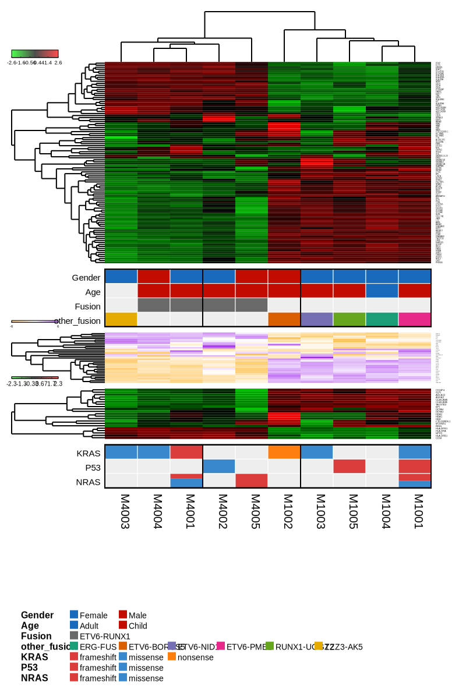
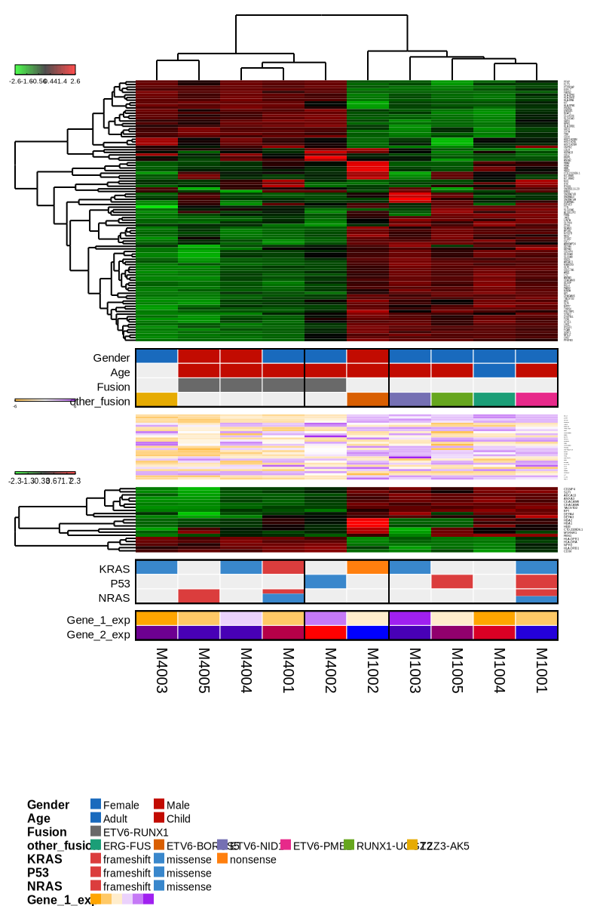

```{r setup, include=FALSE}
knitr::opts_chunk$set(comment = "#>", collapse = TRUE)
```

## DESCRIPTION

Gvmap provide several clustering methods to calculate distance between samples and genes. You can 
input it through a YAML format file with parameter `distfun` or `hclustfun`. Or you can modify it through 
function `gvmapModAttr`.

The basic paramters are as follow:

[param] `distfun` character, function used to compute the distance (dissimilarity) between both rows
and columns. Defaults to dist.  Also, there are other several parameters in distfun, such as "euclidean", 
"maximum", "manhattan", "canberra", "binary" or "minkowski". You can also have a
user-defined function by inputing a function parameter through `gvmapModAttr()`.

[param] `hclustfun` character, function used to compute the hierarchical clustering when Rowv or
Colv are not dendrograms. Defaults to hclust. Also, there are other several parameters in hclustfun,
such as ward.D, ward.D2, single, complete, average, mcquitty, median, centroid. You can also have a
user-defined function by inputing a function parameter through `gvmapModAttr()`.

## EXAMPLES

``` {r}
# prepare heatmap data
heatmap_file <- system.file("extdata", "heatmap.txt", package = "gvmap")

heatmap_data_1 <- read.table(heatmap_file, header = T)
rownames(heatmap_data_1) <- heatmap_data_1$X
heatmap_data_1 <- heatmap_data_1[, -1]

head(heatmap_data_1)

heatmap_data_2 <- heatmap_data_1[20:50, ]
heatmap_data_3 <- heatmap_data_1[80:100, ]

# if you have multiple heatmaps, the heatmap data must be a list
# heatmap_1 is the main heatmap
heatmap_data_mtp <- list(heatmap_1 = heatmap_data_1,
                     heatmap_2 = heatmap_data_2,
                     heatmap_3 = heatmap_data_3)

# prepare legend data
legend_file <- system.file("extdata", "legend.txt", package = "gvmap")

legend_data <- read.table(legend_file, header = T)
row.names(legend_data) <- legend_data$SampleName

legend_data

```

``` {r}
library(easySVG)
library(configr)
library(gvmap)

# read config file
config_file <- system.file('extdata', 'config.mtp.yaml', package = 'gvmap')

config_file <- gvmapConfig(config_file = config_file)

output_svg_name <- paste0(tempdir(), "/o7.svg")

gvmap(legend_data = legend_data,
      heatmap_data = heatmap_data_mtp,
      config_file = config_file,
      output_svg_name = output_svg_name,
      plot_width = 800,
      plot_height = 1200)
```



``` {r}
# using a different cluster method for dist
config_file <- gvmapModAttr(attr_name = "distfun", value = "manhattan", 
                            target = "heatmap_1", config_file = config_file)

output_svg_name <- paste0(tempdir(), "/o8.svg")

gvmap(legend_data = legend_data,
      heatmap_data = heatmap_data_mtp,
      config_file = config_file,
      output_svg_name = output_svg_name,
      plot_width = 800,
      plot_height = 1200)
```



``` {r}
# using a different cluster method for dist
config_file <- gvmapModAttr(attr_name = "hclustfun", value = "ward.D", 
                            target = "heatmap_1", config_file = config_file)

output_svg_name <- paste0(tempdir(), "/o9.svg")

gvmap(legend_data = legend_data,
      heatmap_data = heatmap_data_mtp,
      config_file = config_file,
      output_svg_name = output_svg_name,
      plot_width = 800,
      plot_height = 1200)
```


``` {r}
sessionInfo()
```


