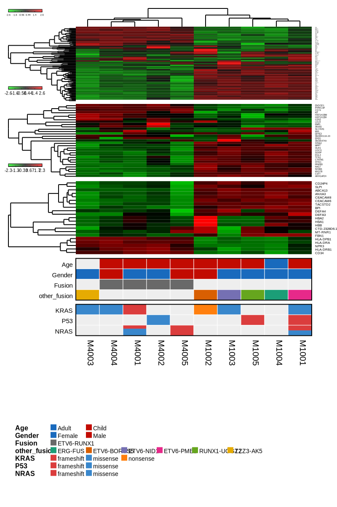
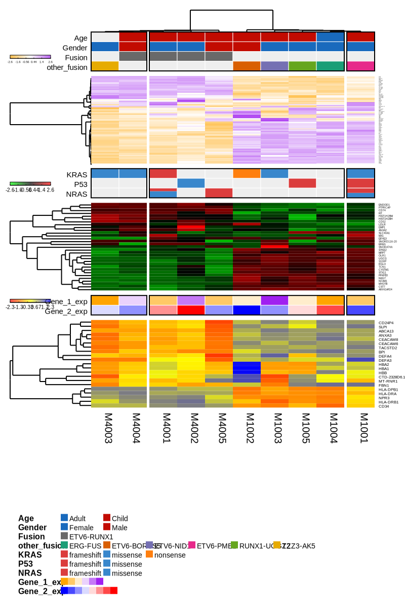

```{r setup, include=FALSE}
knitr::opts_chunk$set(comment = "#>", collapse = TRUE)
```

## DESCRIPTION

Gvmap is an R package that can integrate multiple heatmap and legend figures. 

## INSTALLATION

Gvmap depends on several R packages. They are 
[configr](https://cran.r-project.org/web/packages/configr/index.html), 
[dendextend](https://cran.r-project.org/web/packages/dendextend/index.html), 
[matrixStats](https://cran.r-project.org/web/packages/matrixStats/index.html), 
[easySVG](https://github.com/ytdai/easySVG), 
[rsvg](https://cran.r-project.org/web/packages/rsvg/index.html), and 
[stringr](https://cran.r-project.org/web/packages/stringr/index.html). 

You can install gvmap through github or source code.

## Brief introduction of config parameters

``` {r echo = TRUE, eval = FALSE}
# the config file need to be like this
map_config:
  heatmap_num: 2
  legend_num: 2
  heatmap_1:
    raw_data: FALSE
    kmer_col: 3
    kmer_row: 4
    split_row_name: NULL
    percentage: 0.4
    kmer_col_color: NULL
    kmer_row_color: "pool_col"
    dendrogram: "both"
    Rowv: TRUE
    Colv: TRUE
    color_theme: "gradient_col_gr"
    distfun: "dist"
    hclustfun: "hclust"
  heatmap_2:
    raw_data: TRUE
    split_row_name: NULL
    percentage: 0.1
    dendrogram: "both"
    Rowv: TRUE
    color_theme: "gradient_col_op"
    distfun: "dist"
    hclustfun: "hclust" 
  heatmap_3:
    percentage: 0.1
  legend_1:
    - ["Gender","binary_col", 3]
    - ["Age", "binary_col", 2]
    - ["Fusion", "tag_col", 4]
    - ["other_fusion", "pool_col", 5]
  legend_2:
    - ["KRAS", "mutation_col", 6]
    - ["P53", "mutation_col", 7]
    - ["NRAS", "mutation_col", 8]
  map_order:
    - "heatmap_1"
    - "legend_1"
    - "heatmap_2"
    - "heatmap_3"
    - "legend_2"
  split_sample: 
    - "M1003"
    - "M4002"

color_config:
  bg_col: "#EEEEEE"
  tag_col: "#696969"
  binary_col: ["#196ABD", "#C20B01"]
  white_col: "#FFFFFF"
  black_col: "#000000"
  mutation_col:
    missense: "#3987CC"
    frameshift: "#DB3D3D"
    nonsense: "#FF7F0E"
    protein_del: "#7F7F7F"
    protein_ins: "#8C564B"
    one_hit: "#819981"
    tow_hit: "#499E49"
    three_hit: "#237023"
  pool_col: ["#1B9E77", "#D95F02", "#7570B3", "#E7298A", "#66A61E", "#E6AB02", "#A6761D", "#A6CEE3", "#1F78B4", "#B2DF8A", "#33A02C", "#FB9A99", "#E31A1C", "#FDBF6F", "#FF7F00", "#CAB2D6", "#6A3D9A"]
  gradient_col_gr: ["green", "black", "red"]
  gradient_col_yp: ["yellow", "black", "purple"]
  gradient_col_op: ["orange", "white", "purple"]
  gv_line_col: "#FDBF6F"
  gv_bar_col: "#E6AB02"
  gv_dot_col: "#000000"
  kmer_col: ["green", "blue", "red"]

```

And basic parameters: 

### PARAMETERS IN MAP_CONFIG

**======= HEATMAP ========**

[param] `raw_data`  TRUE or FALSE, determines whether to change the raw data to row z-data to
illustrate the heatmap.

[param] `kmer_col`  number, split the col data by kmer. ATTENTION: only heatmap_1 has this parameter

[param] `kmer_row`  number, split the row data by kmer.

[param] `split_row_name`  vector, the specific row name to split, eg. ["name1", "name2", "name3"]

[param] `percentage`  number, between 0 and 1, the total heatmap percentage of the whole canvas.

[param] `kmer_col_color`  character. Col data color theme of dendrogram.

[param] `kmer_row_color`  character. Row data color them of dendrogram.

[param] `dendrogram`  "both", "col", "row", "none".

[param] `color_theme`  character heatmap gradient colot theme.

[param] `Rowv`  TRUE or FALSE, determines if and how the row dendrogram should be reordered.	By default,
it is TRUE, which implies dendrogram is computed and reordered based on row means.
If NULL or FALSE, then no dendrogram is computed and no reordering is done. If a
dendrogram, then it is used "as-is", ie without any reordering. If a vector of integers,
then dendrogram is computed and reordered based on the order of the vector.

[param] `Colv`  TRUE or FALSE, determines if and how the column dendrogram should be reordered.	Has the options
as the Rowv argument above and additionally when x is a square matrix, Colv = "Rowv" means
that columns should be treated identically to the rows. 

[param] `distfun`  character, function used to compute the distance (dissimilarity) between both rows
and columns. Defaults to dist. 

[param] `hclustfun`  character, function used to compute the hierarchical clustering when Rowv or
Colv are not dendrograms. Defaults to hclust. SEE \link[gplots]{heatmap.2}

**======= LEGEND ========**

the legend data config format is simple

eg:

["Gender","binary_gender_col", 3]

["ETV6-RUNX1", "tag_col", 4]

["KRAS", "mutation_col", 7]

The first element in the vector is legend data. It dose not the same as the colnames in legend data.

The second element in the vector is the color theme, you can choose the color from color config list.

The third element in the vector is the column number.

**======= OTHER ========**

[param] `heatmap_num` the total heatmap number

[param] `legend_num` the total legend number

[param] `map_order` the order of all plot element

[param] `split_sample` split sample name

## Preprare heatmap data and legend data

``` {r}
# heatmap data
heatmap_file <- system.file("extdata", "heatmap.txt", package = "gvmap")

heatmap_data_1 <- read.table(heatmap_file, header = T)
rownames(heatmap_data_1) <- heatmap_data_1$X
heatmap_data_1 <- heatmap_data_1[, -1]

head(heatmap_data_1)

heatmap_data_2 <- heatmap_data_1[20:50, ]
heatmap_data_3 <- heatmap_data_1[80:100, ]

# if you have multiple heatmaps, the heatmap data must be a list
# heatmap_1 is the main heatmap
heatmap_data_mtp <- list(heatmap_1 = heatmap_data_1,
                     heatmap_2 = heatmap_data_2,
                     heatmap_3 = heatmap_data_3)

# legend data
legend_file <- system.file("extdata", "legend.txt", package = "gvmap")

legend_data <- read.table(legend_file, header = T)
row.names(legend_data) <- legend_data$SampleName

legend_data

```

## Paraneters from text

You can write all requred parameters in a YAML file. Examples of YAML file 
can be used follow the instructions below.

``` {r}
library(easySVG)
library(configr)
library(gvmap)

config_file_1 <- system.file('extdata', 'config.sig.yaml', package = 'gvmap')
config_file_2 <- system.file('extdata', 'config.mtp.yaml', package = 'gvmap')
config_file_3 <- system.file('extdata', 'config.leg.yaml', package = 'gvmap')

config_file_1 <- read.config(config_file_1)
config_file_2 <- read.config(config_file_2)
config_file_3 <- read.config(config_file_3)
```

## Paraneters from `gvmapAutoConfig`

You can also generating gvmap config parameters using `gvmapAutoConfig`.

``` {r}
heatmap_info <- list("heatmap_1", "heatmap_2", "heatmap_3")
legend_info <- data.frame(legend_group = c(rep("legend_1", 4), rep("legend_2", 3)),
                          name = colnames(legend_data)[2:8],
                          col_theme = c("binary_col", "binary_col", "tag_col", "pool_col",
                                        "mutation_col", "mutation_col", "mutation_col"),
                          column_num = 2:8)

heatmap_info
legend_info

config_file <- gvmapAutoConfig(heatmap_info = heatmap_info,
                               legend_info = legend_info)


# run gvmap
gvmap(legend_data = legend_data,
      heatmap_data = heatmap_data_mtp,
      config_file = config_file,
      output_svg_name = paste0(tempdir(), "/o5.svg"),
      plot_width = 800,
      plot_height = 1200)
```



## Modify parameters using `gvmapModAttr`

You can modify gvmap parameters using `gvmapModAttr`

``` {r}
# modify color of heatmap_1
config_file <- gvmapModAttr(attr_name = "color_theme", value = "gradient_col_op", target = "heatmap_1", config_file = config_file)

# add split sample name 
config_file <- gvmapModAttr(attr_name = "split_sample", value = c("M1001", "M4001"),
                            config_file = config_file)

# modify map_order
config_file <- gvmapModAttr(attr_name = "map_order", value = c("legend_1", "heatmap_1", "legend_2", "heatmap_2", "heatmap_3"),
                            config_file = config_file)

# add new gradient color
config_file <- gvmapModAttr(attr_name = "gradient_col_ryb", value = c("red", "yellow", "blue"),
                            config_file = config_file)

# modify color of heatmap_3
config_file <- gvmapModAttr(attr_name = "color_theme", value = "gradient_col_ryb", target = "heatmap_3", config_file = config_file)

gvmap(legend_data = legend_data,
      heatmap_data = heatmap_data_mtp,
      config_file = config_file,
      output_svg_name = paste0(tempdir(), "/o6.svg"),
      plot_width = 800,
      plot_height = 1200,
      sample_span = 5)
```



