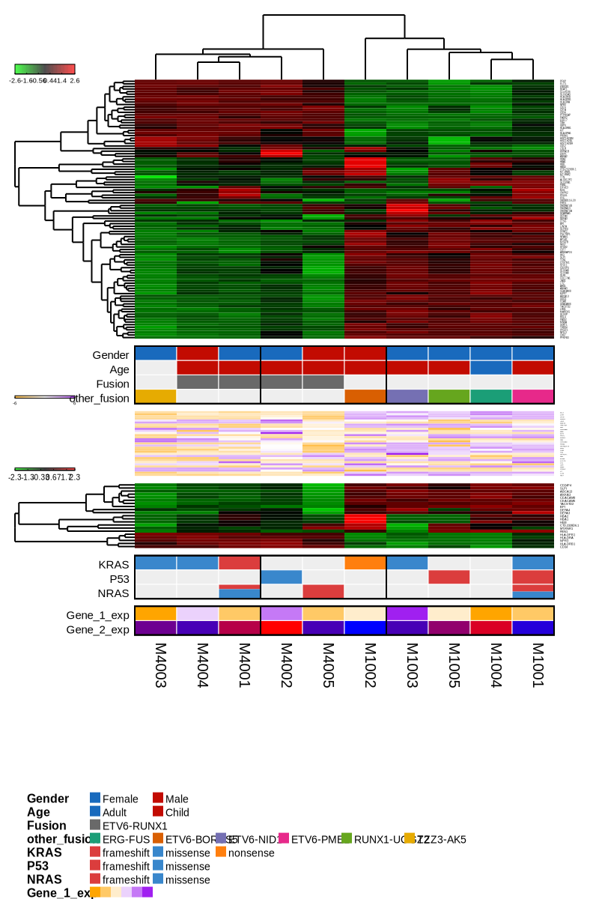
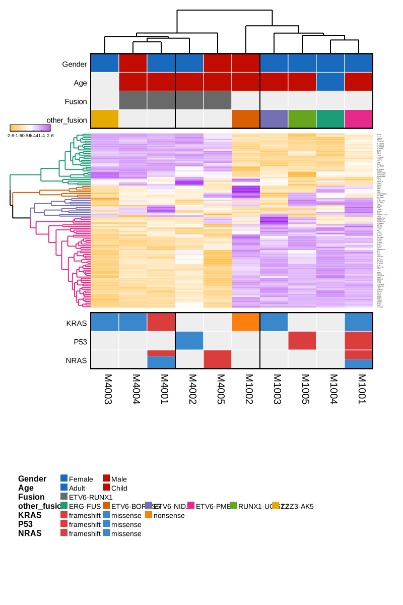
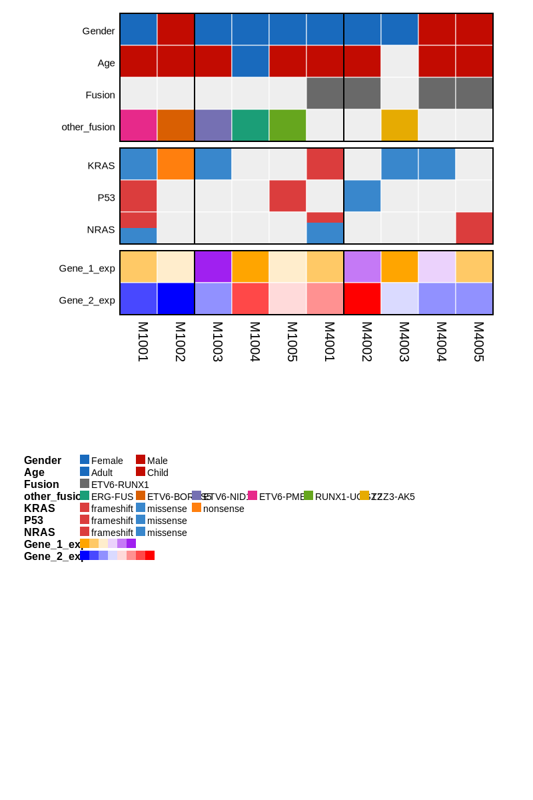
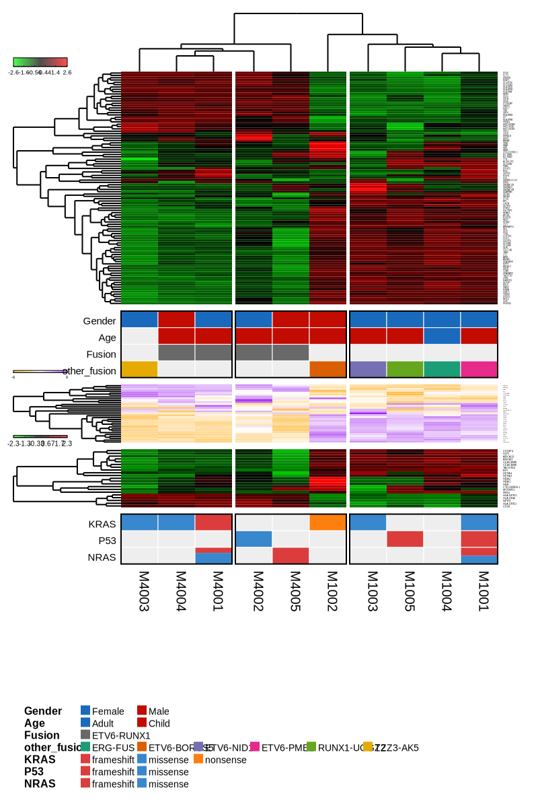

```{r setup, include=FALSE}
knitr::opts_chunk$set(comment = "#>", collapse = TRUE)
```

## DESCRIPTION

Gvmap is an R package that can integrate multiple heatmap and legend figures. 

## INSTALLATION

Gvmap depends on several R packages. They are 
[configr](https://cran.r-project.org/web/packages/configr/index.html), 
[dendextend](https://cran.r-project.org/web/packages/dendextend/index.html), 
[matrixStats](https://cran.r-project.org/web/packages/matrixStats/index.html), 
[easySVG](https://github.com/ytdai/easySVG), 
[rsvg](https://cran.r-project.org/web/packages/rsvg/index.html), and 
[stringr](https://cran.r-project.org/web/packages/stringr/index.html). 

You can install gvmap through github or source code.


### Github

``` {r echo = TRUE, eval = FALSE}
# Install the cutting edge development version from GitHub:
# install.packages("devtools")

# install easySVG
devtools::install_github("ytdai/easySVG")

# install other packages
install.packages("configr")
install.packages("dendextend")
install.packages("matrixStats")
install.packages("rsvg")
install.packages("stringr")

devtools::install_github("ytdai/gvmap")
```

### Source code

``` {r echo = TRUE, eval = FALSE}
install.packages("gvmap_0.1.2.tar.gz")
```

## Required packages

``` {r}
library(easySVG)
library(configr)
library(gvmap)
```

## Prepare heatmap data

The heatmap data must be a list or a matrix, and the name of the list must like this form: heatmap_1, heatmap_2 and so on.

The colnames of each single heatmap data must be the sample, and the rownames can be genes.

**ATTENTION**: heatmap_1 is the main heatmap. This setting is default and there is **ONLY ONE** main heatmap in this figure.

``` {r}
heatmap_file <- system.file("extdata", "heatmap.txt", package = "gvmap")

heatmap_data_1 <- read.table(heatmap_file, header = T)
rownames(heatmap_data_1) <- heatmap_data_1$X
heatmap_data_1 <- heatmap_data_1[, -1]

head(heatmap_data_1)

heatmap_data_2 <- heatmap_data_1[20:50, ]
heatmap_data_3 <- heatmap_data_1[80:100, ]

# if you have multiple heatmaps, the heatmap data must be a list
# heatmap_1 is the main heatmap
heatmap_data_mtp <- list(heatmap_1 = heatmap_data_1,
                     heatmap_2 = heatmap_data_2,
                     heatmap_3 = heatmap_data_3)

# if you only have one heatmap, the heatmap data can be a matrix or a list
# matrix
heatmap_data_sig <- heatmap_data_1
# list
heatmap_data_sig <- list(heatmap_1 = heatmap_data_1)

```

## Prepare legend data

The legend is the supplement, annotation and explanation of heatmap samples. The rownames of legend data 
must be the sample, and the colnames must be the attributes.

``` {r}
legend_file <- system.file("extdata", "legend.txt", package = "gvmap")

legend_data <- read.table(legend_file, header = T)
row.names(legend_data) <- legend_data$SampleName

legend_data
```

## Prepare config file

The config file must be a [YAML](https://en.wikipedia.org/wiki/YAML) format. SEE SECTION **Config paramters**

``` {r}
config_file <- system.file("extdata", "config.sig.yaml", package = "gvmap")

config_file_content <- read.config(config_file)
str(config_file_content)
```

## Run gvmap

``` {r}

# run by default paramter
config_file <- system.file("extdata", "config.mtp.yaml", package = "gvmap")
output_svg_name <- paste0(tempdir(), "/o1.svg")

gvmap(legend_data = legend_data,
      heatmap_data = heatmap_data_mtp,
      config_file = config_file,
      output_svg_name = output_svg_name,
      plot_width = 800,
      plot_height = 1200)
```



``` {r}
# run by default paramter
config_file <- system.file("extdata", "config.sig.yaml", package = "gvmap")
output_svg_name <- paste0(tempdir(), "/o2.svg")

gvmap(legend_data = legend_data,
      heatmap_data = heatmap_data_sig,
      config_file = config_file,
      output_svg_name = output_svg_name,
      plot_width = 800,
      plot_height = 1200)
```



``` {r}
# only legend data
config_file <- system.file("extdata", "config.leg.yaml", package = "gvmap")
output_svg_name <- paste0(tempdir(), "/o3.svg")

gvmap(legend_data = legend_data,
      config_file = config_file,
      output_svg_name = output_svg_name,
      plot_width = 800,
      plot_height = 1200)
```


``` {r}
# add sample span and heatmap span
config_file <- system.file("extdata/config.mtp.yaml", package = "gvmap")
output_svg_name <- paste0(tempdir(), "/o4.svg")

gvmap(legend_data = legend_data,
      heatmap_data = heatmap_data_mtp,
      config_file = config_file,
      output_svg_name = output_svg_name,
      sample_span = 5,
      heatmap_row_span = 4,
      plot_width = 800,
      plot_height = 1200)
```



